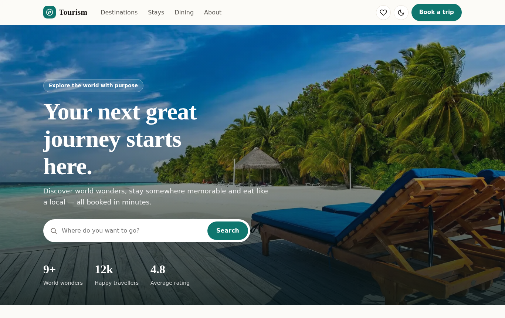
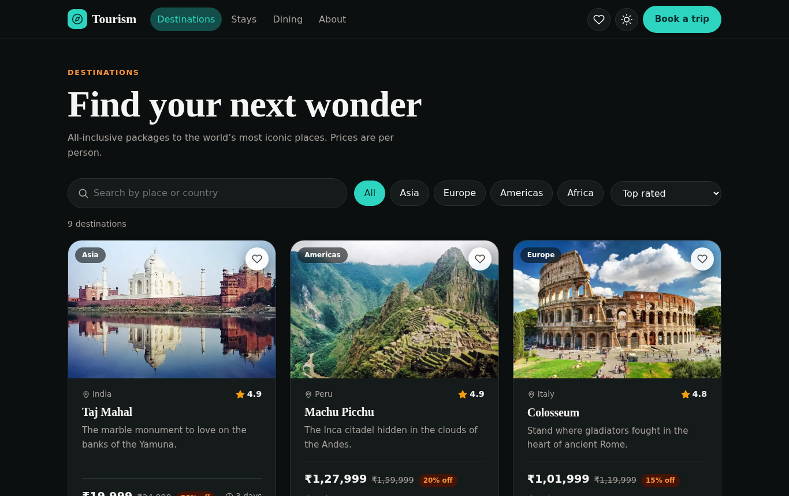
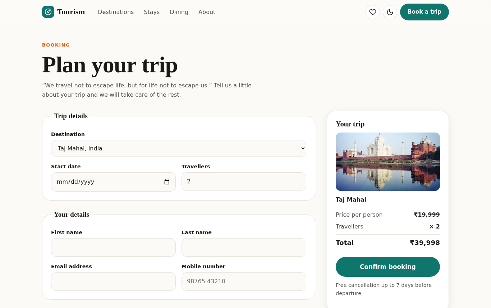
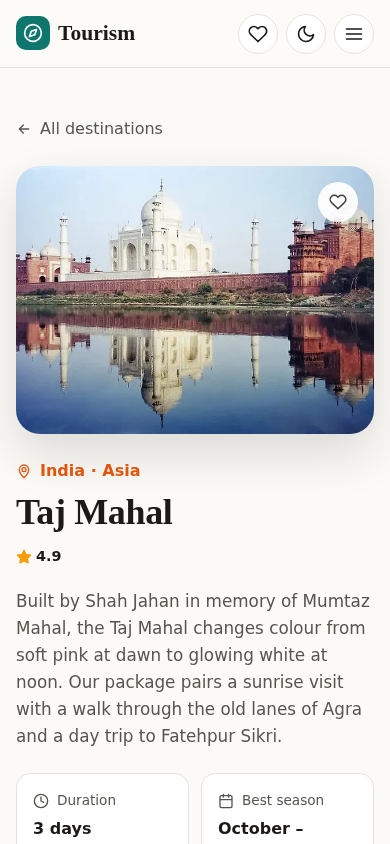
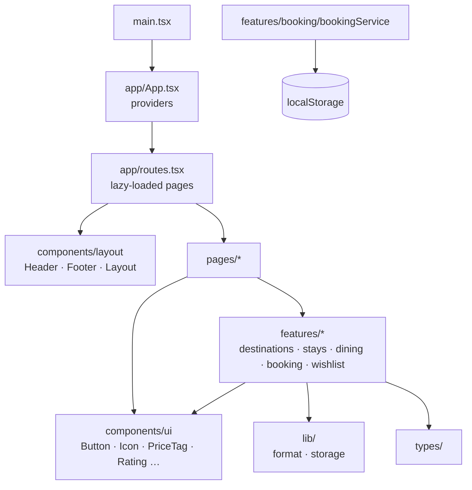

# Tourism — Travel Booking App

A modern travel booking web app where users can explore world-famous destinations, browse stays and
local food, save favourites to a wishlist and book a trip. It is built with **React 19**,
**TypeScript** and **Vite**, and deployed automatically to **GitHub Pages**.

**Live demo:** https://rameti-sivamani.github.io/tourism-booking-app/



## Features

- **Destination explorer**: search by place or country, filter by region and sort by rating or
  price. Filters are stored in the URL, so a filtered view can be bookmarked and shared.
- **Destination detail pages** with itinerary highlights, best season and discounted pricing.
- **Booking flow** with field-level validation, accessible error messages, a live price summary and a
  confirmation page with a booking reference.
- **Wishlist** saved in the browser (`localStorage`), with a live counter in the header.
- **Light and dark themes** that follow the operating system, with a manual toggle.
- **Responsive and accessible**: mobile navigation, skip link, keyboard focus styles, ARIA labels,
  and support for reduced motion.
- **Fast**: each page is code-split and loaded on demand, and images are optimised WebP.

| Destinations (dark mode)                                             | Booking                                       | Mobile                                      |
| -------------------------------------------------------------------- | --------------------------------------------- | ------------------------------------------- |
|  |  |  |

## Tech stack

| Area       | Choice                                                            |
| ---------- | ----------------------------------------------------------------- |
| UI         | React 19, TypeScript (strict mode)                                |
| Routing    | React Router 7 with lazy-loaded routes                            |
| Styling    | CSS Modules with design tokens (CSS custom properties)            |
| Build      | Vite                                                              |
| Testing    | Vitest, React Testing Library, jsdom                              |
| Code style | Oxlint, Prettier                                                  |
| CI/CD      | GitHub Actions: lint, type-check, test, build and deploy to Pages |

## Architecture

The code is organised **by feature**: everything about one part of the product (its data, logic,
components and tests) sits in the same folder. Shared building blocks live in `components/`, and
`pages/` put the features together into screens.



```text
src/
├── app/                  # App shell: providers, route table and integration tests
├── components/
│   ├── layout/           # Header, Footer, Layout, navigation links
│   └── ui/               # Reusable UI components (Button, Icon, PriceTag, Rating…)
├── features/
│   ├── booking/          # BookingForm, validation rules, bookingService (+ tests)
│   ├── destinations/     # Destination data, cards, grid, search/filter logic (+ tests)
│   ├── dining/           # Dish data and cards
│   ├── stays/            # Stay data and cards
│   └── wishlist/         # Wishlist context, provider, hook and button
├── hooks/                # useTheme, useDocumentTitle
├── lib/                  # Framework-independent helpers: formatting, safe storage
├── pages/                # One component per route
├── styles/               # Design tokens and global styles
├── test/                 # Test setup
└── types/                # Shared domain types
```

### Design decisions

- **Business logic lives in plain functions**, not in components. `validateBooking`,
  `filterDestinations` and the price helpers are pure TypeScript functions, so they are easy to
  unit-test and reuse.
- **The data layer is behind an async service.** `bookingService` stores bookings in
  `localStorage` today, but it exposes `create`, `list` and `get` as `Promise`s. It can be replaced
  with real API calls to a backend without changing any component.
- **State lives in the right place.** Search filters live in the URL, the wishlist is in React
  context (persisted to storage), and form state stays local to the form.
- **Design tokens** (`src/styles/tokens.css`) define colours, spacing, radii and shadows once. Dark
  mode redefines the tokens instead of every component.
- **The deploy path follows the repository name.** The deploy workflow sets `BASE_PATH` from the
  repository name, so renaming the repository needs no code change.

## Getting started

Requires Node.js 20 or newer.

```bash
npm install
npm run dev        # start the dev server at http://localhost:5173
```

| Script               | What it does                                     |
| -------------------- | ------------------------------------------------ |
| `npm run dev`        | Start the development server with hot reload     |
| `npm test`           | Run the unit and integration tests once          |
| `npm run test:watch` | Run tests in watch mode                          |
| `npm run lint`       | Lint with Oxlint                                 |
| `npm run typecheck`  | Type-check with the TypeScript compiler          |
| `npm run format`     | Format all files with Prettier                   |
| `npm run build`      | Type-check and build for production into `dist/` |
| `npm run preview`    | Serve the production build locally               |

## Testing

32 tests cover the booking validation rules, the booking service, search and sort logic, price
formatting, and full user flows. These include searching from the home page, saving to the
wishlist, and completing a booking end to end.

```bash
npm test
```

## Deployment

Every push to `main` runs `.github/workflows/deploy.yml`, which tests the app, builds it and
publishes it to GitHub Pages. Pull requests and other branches run the checks in
`.github/workflows/ci.yml`.

To enable GitHub Pages the first time, open **Settings → Pages** in the repository and set
**Source** to **GitHub Actions**.

## Roadmap

- Backend API (Node.js + Express or a serverless function) to store bookings and send confirmation
  emails
- User accounts with booking history
- Payment integration
- End-to-end tests with Playwright

## License

[Apache 2.0](LICENSE)
